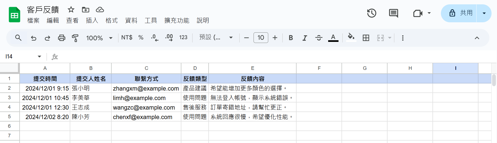
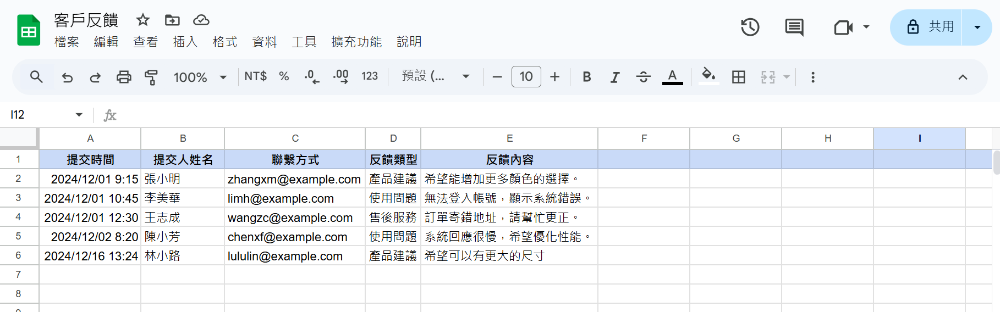
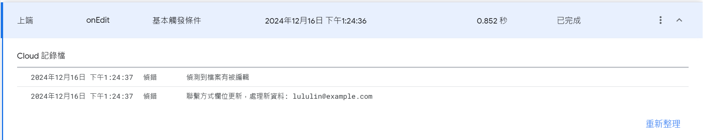

# Google Apps Script Monitor Sheet

撰寫 Google Apps Script 監視 Google Sheet 的變動資訊。

範例檔案 [客戶反饋.csv](客戶反饋.csv)，程式碼示範監測 sheet 中的 `聯繫方式` 欄位並抓取資料檢驗 email 格式以便做後續處理。

## Overview

- 語言: JavaScript

## Step

### 1. Set up and deploy the script
在 Google Sheet -> `擴充功能` -> `Apps Script` 內貼上程式碼  
點選右上角的 `新增部署作業` -> `網頁應用程式` -> `部署`  


### 2. Test editing



新增一行資訊 
```
2024/12/16 13:24,林小路,lululin@example.com,產品建議,希望可以有更大的尺寸
```




編輯後可在左側 `執行項目` 內看到對應的 Log



