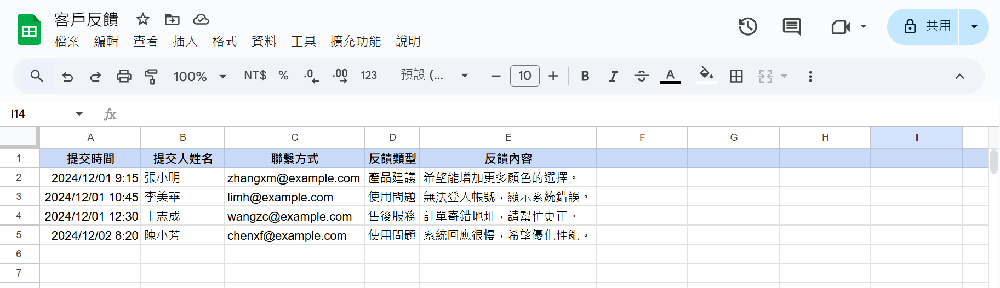
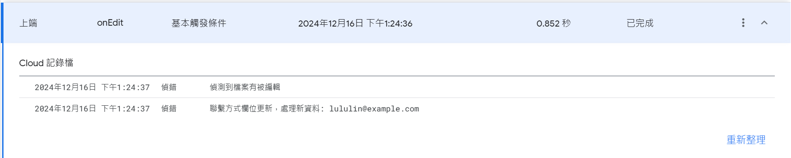

# Google Apps Script Monitor Sheet

**(also provided Traditional Chinese version document [README-CH.md](README-CH.md).)**

Write a Google Apps Script to monitor changes in a Google Sheet.

Sample file: [客戶反饋.csv](客戶反饋.csv). The code demonstrates monitoring the "Contact Method" column and extracting the data to validate the email format for further processing.

## Overview

- Language: JavaScript

## Steps

### 1. Set up and deploy the script
In Google Sheets -> `Add-ons` -> `Apps Script`, paste the code.  
Click on the top right `New deployment` -> `Web App` -> `Deploy`.

### 2. Test editing



Add a new row of information:
```
2024/12/16 13:24,林小路,lululin@example.com,產品建議,希望可以有更大的尺寸
```


After editing, you can view the corresponding logs in the left sidebar under `Executions`.

